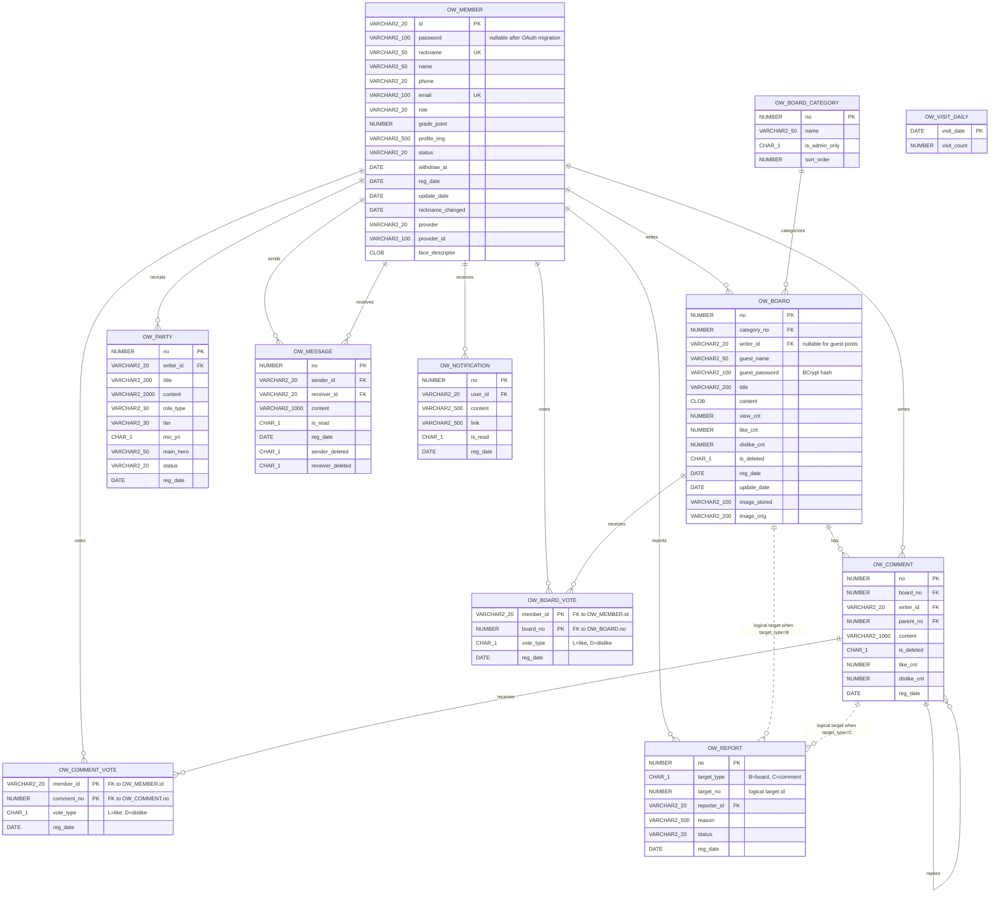

# UnderWatch ERD

이 문서는 현재 코드 기준의 데이터 모델을 정리한 ERD입니다.
기준 파일은 `src/main/resources/sql/schema.sql`, `src/main/resources/sql/add_*.sql`,
`src/main/resources/config/sqlMap/oracle/*.xml`, 각 `VO`/service/controller 코드입니다.

## 전체 ERD

## 테이블 요약

| 테이블 | 역할 | 주요 관계 |
| --- | --- | --- |
| `ow_member` | 회원, 권한, OAuth, 얼굴 로그인 정보 | 게시글/댓글/투표/쪽지/알림/신고/파티의 기준 회원 |
| `ow_board_category` | 게시판 카테고리 | `ow_board.category_no`가 참조 |
| `ow_board` | 게시글 | 회원 또는 게스트 작성자, 카테고리에 속하고 댓글/투표/신고 대상이 됨 |
| `ow_comment` | 댓글/대댓글 | 게시글과 회원을 참조하고 `parent_no`로 자기 자신 참조 |
| `ow_board_vote` | 추천/비추천 이력 | 회원과 게시글의 N:M 연결 테이블 |
| `ow_comment_vote` | 댓글 추천/비추천 이력 | 회원과 댓글의 N:M 연결 테이블 |
| `ow_report` | 신고 | 신고자는 회원 FK, 신고 대상은 `target_type + target_no` 논리 참조 |
| `ow_visit_daily` | 일별 방문 수 | 독립 집계 테이블 |
| `ow_party` | 파티/구인구직 게시글 | 작성 회원 참조 |
| `ow_message` | 1:1 쪽지 | 발신자/수신자 모두 회원 참조 |
| `ow_notification` | 알림 | 수신 회원 참조, 이동 대상은 `link` 문자열 |

## 물리 FK

| FK 컬럼 | 참조 | 삭제 정책 |
| --- | --- | --- |
| `ow_board.category_no` | `ow_board_category.no` | 기본 제한 |
| `ow_board.writer_id` | `ow_member.id` | 기본 제한 |
| `ow_comment.board_no` | `ow_board.no` | `ON DELETE CASCADE` |
| `ow_comment.writer_id` | `ow_member.id` | 기본 제한 |
| `ow_comment.parent_no` | `ow_comment.no` | 기본 제한 |
| `ow_board_vote.member_id` | `ow_member.id` | 기본 제한 |
| `ow_board_vote.board_no` | `ow_board.no` | `ON DELETE CASCADE` |
| `ow_comment_vote.member_id` | `ow_member.id` | 기본 제한 |
| `ow_comment_vote.comment_no` | `ow_comment.no` | `ON DELETE CASCADE` |
| `ow_party.writer_id` | `ow_member.id` | 기본 제한 |
| `ow_message.sender_id` | `ow_member.id` | 기본 제한 |
| `ow_message.receiver_id` | `ow_member.id` | 기본 제한 |
| `ow_notification.user_id` | `ow_member.id` | 기본 제한 |
| `ow_report.reporter_id` | `ow_member.id` | 기본 제한 |

## 논리 관계

| 컬럼 | 의미 | 코드 기준 |
| --- | --- | --- |
| `ow_report.target_type = 'B'`, `target_no` | 신고 대상이 게시글 | 관리자 블라인드 처리 시 `boardService.delete(targetNo)` 호출 |
| `ow_report.target_type = 'C'`, `target_no` | 신고 대상이 댓글 | 관리자 블라인드 처리 시 `commentService.blind(targetNo)` 호출 |
| `ow_notification.link` | 알림 클릭 이동 경로 | 댓글/추천 알림에서 `/board/detail?no=...` 저장 |
| `ow_board.image_stored`, `image_orig` | 게시글 첨부 이미지 파일명 | 실제 파일은 `D:/Serv/ServM/uploads/`에 저장 |
| `ow_board.writer_id IS NULL`, `guest_name`, `guest_password` | 비회원 게시글 | BCrypt 해시 비밀번호로 수정/삭제 검증 |
| `ow_member.status='WITHDRAWN'`, `withdraw_at` | 탈퇴 대기 회원 | 7일 안에 로그인 시 복구, 이후 스케줄러 삭제 |
| `ow_member.face_descriptor` | 얼굴 로그인 임베딩 JSON | `MemberServiceImpl.saveFace()`가 직접 저장 |

## 주요 제약과 인덱스

| 대상 | 제약/인덱스 |
| --- | --- |
| `ow_member.id` | PK |
| `ow_member.nickname` | UNIQUE |
| `ow_member.email` | UNIQUE |
| `ow_member(provider, provider_id)` | UNIQUE INDEX `uq_member_provider` |
| `ow_board_vote(member_id, board_no)` | 복합 PK, 회원당 게시글 1개 투표 |
| `ow_comment_vote(member_id, comment_no)` | 복합 PK, 회원당 댓글 1개 투표 |
| `ow_board.category_no` | INDEX `idx_board_category` |
| `ow_board.reg_date` | INDEX `idx_board_regdate` |
| `ow_board.writer_id` | INDEX `idx_board_writer` |
| `ow_comment.board_no` | INDEX `idx_comment_board` |

## 시퀀스

| 시퀀스 | 사용 테이블 |
| --- | --- |
| `seq_ow_board_category_no` | `ow_board_category.no` |
| `seq_ow_board_no` | `ow_board.no` |
| `seq_ow_comment_no` | `ow_comment.no` |
| `seq_ow_report_no` | `ow_report.no` |
| `seq_ow_party_no` | `ow_party.no` |
| `seq_ow_message_no` | `ow_message.no` |
| `seq_ow_notification_no` | `ow_notification.no` |
